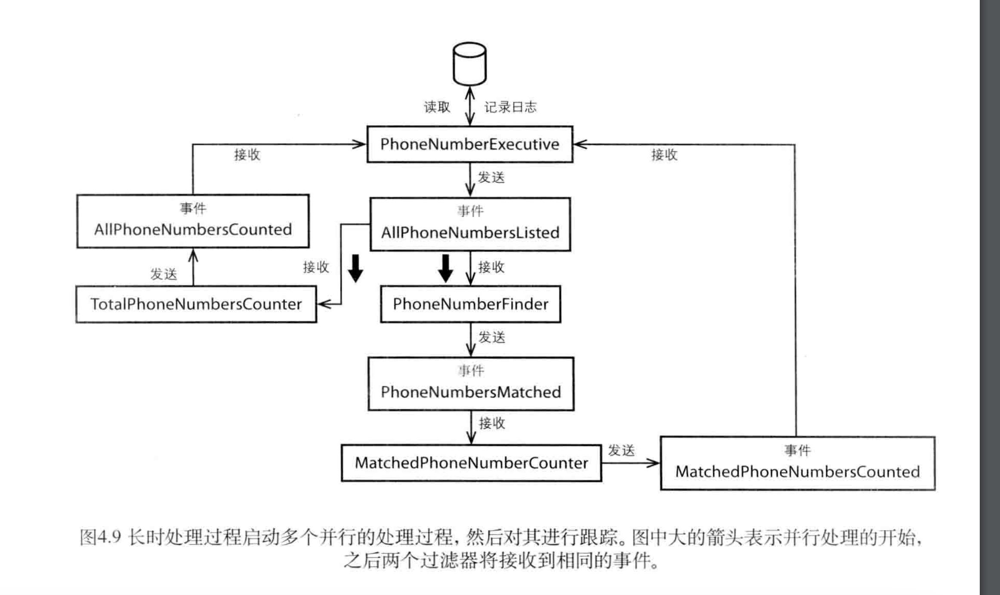

# 基于CompletableFuture的异步调用执行器

## 概要


## TaskContext 任务上下文
包含初始数据 任务执行时间 任务执行后的数据

## TaskExecutor 任务执行器

开始任务 任务调度

## TaskParser 任务解析器
json路径 resources 下 的task文件夹中

解析后的任务名称为文件名不带后缀 解析后会生成TaskMetaData

## TaskMetaData 任务元数据

## json配置

```json
[
  {
    "jobName": "ListExpertInfoJob",
    "jobClass": "com.bo.job.ListExpertInfoJob"
  },
  {
    "jobName": "ListExportEnterDatabaseInfoDTOJob",
    "jobClass": "com.bo.job.ListExportEnterDatabaseInfoDTOJob",
    "dependsOn": [
      "ListExpertInfoJob"
    ]
  }
]

```
# 项目启动 

Application.java中

示例接口

DemoController中  地址 http://127.0.0.1:8080/demo
